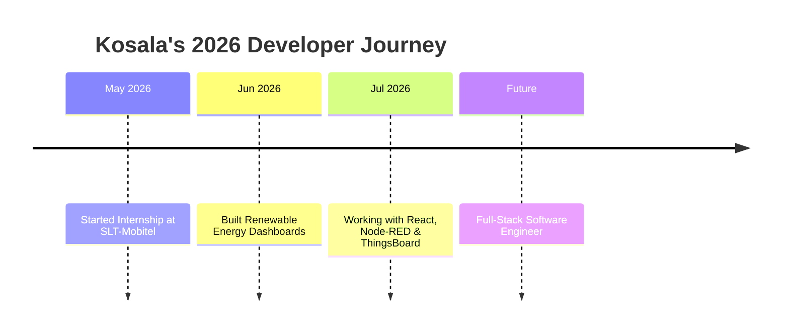

<div align="center">
  
</div>

---

<div align="center">
  
</div>

<div align="center">
  
</div>

---

<div align="center">
  <a href="https://www.linkedin.com/in/kosala-d-athapaththu-a453b9248/">
    
  </a>
  <a href="https://x.com/KAthapathtu">
    
  </a>
  <a href="mailto:kosalaathapaththu1234@gmail.com">
    
  </a>
  <a href="https://wa.me/94719148762">
    <a href="https://wa.me/000000">
    
  </a>
  <a href="https://github.com/kosaladathapththu">
    
  </a>
  <br><br>
  
  
  
</div>

---

## 🧑‍💻 About Me

<table align="center">
<tr>
<td width="55%">

```java
public class Kosala extends Developer {

    String name     = "A.M. Kosala Dhaneshwara Athapaththu";
    String degree   = "BSc (Hons) Software Engineering";
    String uni      = "NIBM / Coventry University";
    String location = "Colombo, Sri Lanka 🇱🇰";
    int    repos    = 30; // and growing...

    String currentRole = "Software Developer Intern @ SLT-Mobitel";

    String[] focus = {
        "Full-Stack Web Development",
        "Backend & Microservices",
        "Android Development",
        "IoT & Renewable Energy Monitoring",
        "Machine Learning"
    };

    boolean openToWork   = true;
    boolean openToCollab = true;
    String  motto = "Clean Code + Innovation + UX";
}
```

</td>
<td width="45%" align="center">
  
  <br>
  
</td>
</tr>
</table>

---

## 💼 Experience

<table width="100%">
<tr>
<td width="50%" valign="top">

### 🚀 Software Developer Intern
**SLT-Mobitel · Colombo**
`May 2026 — Present`

- Built React-based operational dashboards
- Integrated Node-RED APIs for live data flows
- Connected ThingsBoard telemetry pipelines
- Designed renewable energy monitoring UIs

</td>
<td width="50%" valign="top">

### ⚡ Renewable Energy Dashboard Developer
**Ceylex Renewable Energy Projects**

- Solar & hydro power plant dashboards
- Wind power plant digital twin
- MQTT telemetry visualization
- Real-time plant status monitoring

</td>
</tr>
</table>

---

## 🛠️ Tech Arsenal

<div align="center">
  
  
  
  
  
  
</div>

<br>

<div align="center">
  
  <br><br>
  
</div>

<br>

<div align="center">

**Languages**


**Frameworks & Platforms**


**Databases & Tools**


</div>

---

## 🚀 Epic Project Showcase

<div align="center">
  
</div>

<table>
<tr>
<td width="50%">

### 🛠️ AC Service Management System
> **Client Project — Supun Group of Companies**

- Customer & AC unit management
- Service tracking & payment records
- Google Sheets as live database (Apps Script)
- Automated reminder emails


[](https://github.com/kosaladathapththu/AC-Service-Management-System)

</td>
<td width="50%">

### 💧 Hydro Power Dashboard
> **Renewable Energy Monitoring**

- Real-time hydro plant operational data
- Live plant status monitoring
- Clean dashboard layout for energy data


[](https://github.com/kosaladathapththu/hydro-power-dashboard)

</td>
</tr>
<tr>
<td width="50%">

### ✍️ Poetry Web App
> **Bilingual Client Portfolio Site**

- English / Sinhala bilingual support
- Decap CMS self-publishing for a non-technical client
- Netlify Identity admin access


[](https://github.com/kosaladathapththu/Poetry-Web-App)

</td>
<td width="50%">

### ☀️ Solar Soiling Web App
> **Solar Accuracy / ML-Based Analysis**

- Solar panel soiling analysis
- Data processing with notebooks
- Supports solar plant performance monitoring


[](https://github.com/kosaladathapththu/solar-soiling-web-app)

</td>
</tr>
<tr>
<td width="50%">

### ⚡ Sola Edge Dashboard
> **Solar Energy Dashboard**

- Solar monitoring dashboard
- Energy data visualization
- Plant performance UI


[](https://github.com/kosaladathapththu/Sola-Edge-Dashboard)

</td>
<td width="50%">

### 🏠 Hostel Management System
> **Full-Stack Admin Portal**

- 🏫 End-to-end hostel operations
- 📅 Room allocation & inventory tracking
- 💰 Billing & payroll processing
- 📊 Reports & analytics


[](https://github.com/kosaladathapththu/Hostel-Management-System)

</td>
</tr>
<tr>
<td width="50%">

### 🏨 Hotel Management System
> **Microservices Architecture**

- 🧠 Microservice-based backend on Spring Boot
- ⚛️ React frontend with admin dashboard
- 🏨 Room booking, guest management & billing
- 🔄 RESTful APIs + MySQL


[](https://github.com/kosaladathapththu/Hotel-Management-System)

</td>
<td width="50%">

### 🍕 PizzaMania
> **Android App**

- 📱 Food ordering Android app
- 🗄️ Java + SQLite local storage
- 🔥 Firebase integration


[](https://github.com/kosaladathapththu/PizzaMania)

</td>
</tr>
</table>

<details>
<summary><b>⚡ More projects</b></summary>
<br>

| Project | Description | Tech |
|---|---|---|
| [Landslide_Ditection-IOT](https://github.com/kosaladathapththu/Landslide_Ditection-IOT) | IoT-based landslide early-warning system | C++ |
| [Trash-Collecting-Robot-For--River](https://github.com/kosaladathapththu/Trash-Collecting-Robot-For--River) | Robot system for river trash collection | Arduino, C++ |
| [Online-Payments-Fraud-Detection](https://github.com/kosaladathapththu/Online-Payments-Fraud-Detection) | ML model for payment fraud detection | Python, Jupyter |
| [LibraryManagementSystem](https://github.com/kosaladathapththu/LibraryManagementSystem) | Desktop app for library operations | C#, .NET |
| [Smart-Student-Result-Management-System](https://github.com/kosaladathapththu/Smart-Student-Result-Management-System-using-Binary-Search-Tree-BST) | Result management system using a BST | Java |
| [Code_Evolution_Tracker](https://github.com/kosaladathapththu/Code_Evolution_Tracker) | Debugging timeline tool (Stack, Linked List, BST/AVL) | Java |

</details>

---

## ⚡ Current Focus & 2026 Vision

<div align="center">
  
</div>

<br>

<table align="center">
<tr>
<td align="center" width="33%">

### 🎯 Current Projects
```javascript
const now = {
  internship: "Renewable energy dashboards",
  dashboards: "Hydro, solar & edge monitoring",
  clients:    "CMS-driven client sites",
  portfolio:  "30+ public repositories"
};
```

</td>
<td align="center" width="33%">

### 🚀 Goals 2026
```python
goals_2026 = {
    "cloud":      "Production deployments",
    "open_source":"More contributions",
    "certs":      "Cloud certification",
    "github":     "Grow stars & followers"
}
```

</td>
<td align="center" width="33%">

### 🌟 Career Path
```yaml
path:
  now:      "SE Undergraduate"
  next:     "Industry Professional"
  ultimate: "Tech Entrepreneur"

expanding:
  - IoT & telemetry systems
  - Full-stack architecture
  - AI/ML integration
```

</td>
</tr>
</table>

---

## 📌 2026 Journey



---

## 📊 GitHub Stats

<div align="center">
  
  
</div>

<div align="center">
  
</div>

<div align="center">
  
</div>

---

## 🏆 GitHub Trophies

<div align="center">
  
</div>

---

## 🐍 Contribution Snake

<div align="center">
  <picture>
    <source media="(prefers-color-scheme: dark)" srcset="https://github.com/kosaladathapththu/kosaladathapththu/blob/output/github-contribution-grid-snake-dark.svg" />
    <source media="(prefers-color-scheme: light)" srcset="https://github.com/kosaladathapththu/kosaladathapththu/blob/output/github-contribution-grid-snake.svg" />
    
  </picture>
</div>

> ⚠️ You already have the special `kosaladathapththu` profile repo — it just needs the [Platane/snk](https://github.com/Platane/snk#-getting-started) GitHub Action (`snake.yml`) added to activate this. Happy to write that workflow file for you if you want it live.

---

## 💭 Developer Philosophy

<div align="center">
  
</div>

<div align="center">
  
</div>

<br>

<div align="center">

| 🎯 Focus | 💡 Philosophy | 🚀 Action |
|:---:|:---:|:---:|
| **Quality** | *"Readable = Maintainable"* | Self-documenting code |
| **UX** | *"Design for humans"* | User-centered approach |
| **Problem Solving** | *"Creative solutions exist"* | Think unconventionally |
| **Learning** | *"Stay curious & hungry"* | Daily experimentation |
| **Teamwork** | *"Great teams = Great software"* | Open collaboration |

</div>

---

## 🎮 Fun Developer Corner

<div align="center">
  
</div>

<br>

```javascript
const kosala = {
    active_repos:       "30+ public repositories 📦",
    projects_delivered: "Client + personal full-stack apps 🎯",
    coffee_consumed:    "Immeasurable ☕",
    current_status:     "Always building something cool 🚀"
};
```

---

## 🤝 Let's Connect & Collaborate

<div align="center">
  
</div>

<div align="center">
  
</div>

<br>

<div align="center">
  <a href="https://www.linkedin.com/in/kosala-d-athapaththu-a453b9248/">
    
  </a>
  <a href="mailto:kosalaathapaththu1234@gmail.com">
    
  </a>
  <a href="https://wa.me/94719148762">
    
  </a>
</div>

<br>

<div align="center">
  <i>✨ "Code with passion, debug with patience, deploy with confidence!" ✨</i>
  <br><br>
  <b>🌟 Thanks for visiting my profile! Let's build something extraordinary together! 🌟</b>
</div>

<br>

<div align="center">
  
</div>
