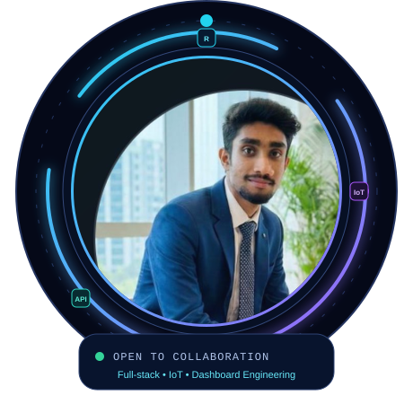
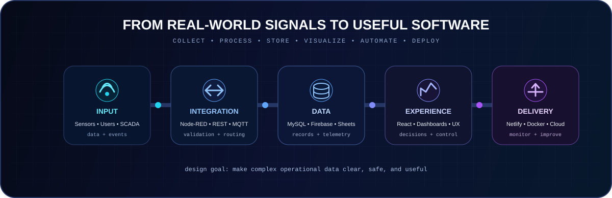
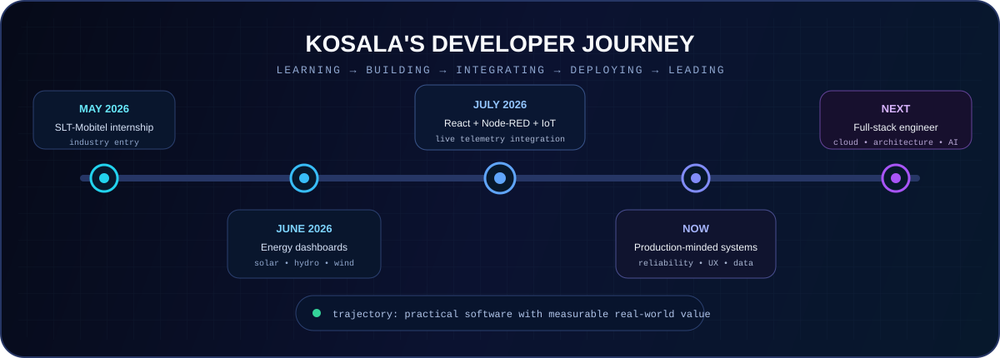

  

 

  

  
  
  
  

  
  
  
  

 

About •Experience •Capabilities •Technology •Projects •Analytics •Journey •Contact

About Me

<table width="100%">
<tr>
<td width="61%" valign="top">

A.M. Kosala Dhaneshwara Athapaththu

I am a Software Engineering undergraduate and a Software Developer Intern at SLT-Mobitel. I build software that connects clean interfaces, useful data, backend integrations, and practical business processes.

My recent work includes:

React dashboards for operational and renewable-energy data

Node-RED API flows and live-data integrations

ThingsBoard and MQTT telemetry dashboards

Full-stack business systems

Client websites and publishing platforms

Machine-learning supported web applications

Android and desktop application projects

public final class Kosala extends SoftwareEngineer {

    String role       = "Software Developer Intern @ SLT-Mobitel";
    String degree     = "BSc (Hons) Software Engineering";
    String university = "NIBM / Coventry University";
    String location   = "Colombo, Sri Lanka";

    String[] focus = {
        "Full-Stack Web Development",
        "Backend APIs and Microservices",
        "IoT and Telemetry Systems",
        "Renewable Energy Monitoring",
        "Applied Machine Learning",
        "User-Focused Product Design"
    };

    boolean openToCollaboration = true;
    boolean alwaysLearning      = true;

    String principle =
        "Build clearly. Test carefully. Improve continuously.";
}

</td>
<td width="39%" align="center" valign="middle">
  
</td>
</tr>
</table>

Professional Snapshot

<table width="100%">
<tr>
<td width="25%" align="center" valign="top">

Current Role

Software Developer Intern

SLT-Mobitel, Colombo

May 2026 — Present

</td>
<td width="25%" align="center" valign="top">

Education

BSc (Hons)

Software Engineering

NIBM / Coventry University

</td>
<td width="25%" align="center" valign="top">

Main Direction

Full-Stack + IoT

React, APIs, Node-RED, ThingsBoard, telemetry, and dashboards

</td>
<td width="25%" align="center" valign="top">

Working Style

Practical Engineering

Clear UI, safe workflows, maintainable code, and real-world value

</td>
</tr>
</table>

Professional Experience

Software Developer Intern — SLT-Mobitel

Colombo, Sri LankaMay 2026 — Present

My internship work combines software development, operational dashboards, API integration, and renewable-energy monitoring.

Main responsibilities

Build responsive React interfaces for operational dashboards

Connect frontend components to Node-RED and REST API endpoints

Present real-time plant data in clear visual formats

Work with telemetry keys, equipment status, trends, faults, and warnings

Support ThingsBoard device integration and dashboard configuration

Design interfaces for solar, hydro, and wind power monitoring

Improve frontend structure, usability, and deployment readiness

Test data flow from source systems to user-facing dashboards

Work carefully with systems where operational reliability is important

Technologies used

React JavaScript Node-RED REST APIs ThingsBoard MQTT JSON Git Netlify Windows deployment

Renewable Energy Software Work

My renewable-energy work is focused on converting plant and telemetry data into clear information for operators and technical teams.

<table width="100%">
<tr>
<td width="33%" valign="top">

Solar

Plant production indicators

Soiling and performance analysis

Equipment and inverter data

Dashboard layouts

Digital-twin concepts

Status and trend visualization

</td>
<td width="33%" valign="top">

Hydro

Plant status dashboards

Operational values

Generation information

Clear visualization panels

Responsive monitoring layouts

API-connected frontend components

</td>
<td width="33%" valign="top">

Wind

Turbine-level information

Active and reactive power

Voltage and frequency

Wind speed and direction

Fault and warning counts

Plant availability and status

</td>
</tr>
</table>

Engineering Capabilities

<table width="100%">
<tr>
<td width="33%" valign="top">

Frontend Engineering

React component development

Responsive dashboard layouts

Data tables and cards

Modal and form workflows

Visual status indicators

Mobile and desktop adaptation

State management fundamentals

User-focused interface decisions

</td>
<td width="33%" valign="top">

Backend and Integration

REST API integration

Spring Boot fundamentals

PHP and MySQL systems

Google Apps Script APIs

Node-RED HTTP endpoints

JSON payload handling

Authentication flow concepts

CRUD operations and validation

</td>
<td width="33%" valign="top">

IoT and Data Systems

MQTT telemetry

ThingsBoard devices and widgets

Node-RED data flows

Sensor-data concepts

Real-time dashboard updates

Device status visualization

Operational alarm presentation

Renewable-energy data structures

</td>
</tr>
<tr>
<td width="33%" valign="top">

Database Work

MySQL database design

Relational tables and joins

CRUD queries

Foreign keys

Reporting queries

Google Sheets as lightweight storage

Firebase fundamentals

SQLite for Android applications

</td>
<td width="33%" valign="top">

Software Design

Role-based systems

Business process mapping

Dashboard information hierarchy

Reusable UI components

Multi-module applications

Microservices concepts

Data-flow planning

Error handling and debugging

</td>
<td width="33%" valign="top">

Delivery and Collaboration

Git and GitHub workflow

Netlify deployment

Vite production builds

Client requirement understanding

Technical documentation

Iterative improvement

Issue investigation

Team communication

</td>
</tr>
</table>

System Integration Approach

  

How I usually approach a software problem

Understand the real business or operational need.

Identify users, roles, data sources, actions, and risks.

Design the main screens and data flow.

Build a clear frontend structure.

Connect APIs, databases, telemetry, or automation flows.

Add validation and useful error messages.

Test normal cases and failure cases.

Improve performance, usability, and deployment setup.

Document the final workflow.

Continue improving after real user feedback.

Technology Ecosystem

Languages

  

 

Frameworks and Application Platforms

  

 

Databases, APIs, and Automation

  

 

Development, Design, and Deployment Tools

  

 

Skill Matrix

Area

Working knowledge

Current direction

Frontend

React, JavaScript, HTML, CSS, responsive layouts, dashboard components

Stronger architecture, TypeScript, testing, accessibility

Backend

Java, Spring Boot fundamentals, PHP, REST APIs, Google Apps Script

Production APIs, security, microservices, cloud deployment

Databases

MySQL, SQLite, Firebase, Google Sheets

Query optimization, stronger schema design, scalable data services

IoT

Node-RED, ThingsBoard, MQTT, telemetry, device dashboards

Digital twins, alerting, reliable device-to-cloud architecture

Machine Learning

Python, notebooks, model-supported applications

Better deployment, evaluation, APIs, usable ML products

Mobile

Java Android, SQLite, Firebase

Modern Android patterns and cross-platform exploration

Desktop

C#, .NET, WinForms, reporting

Clean architecture and better application packaging

DevOps

GitHub, Netlify, build deployment, Windows startup workflows

Docker, CI/CD, monitoring, cloud infrastructure

Design

Figma basics, visual hierarchy, responsive UI

Design systems, accessibility, consistent component libraries

Current Work and Learning

<table width="100%">
<tr>
<td width="50%" valign="top">

Building Now

Renewable-energy dashboards

Client management systems

POS and ERP-oriented workflows

Personal branding portfolio

React API integrations

IoT telemetry interfaces

Production deployment improvements

Better GitHub project documentation

</td>
<td width="50%" valign="top">

Learning Now

Advanced React patterns

Better TypeScript usage

Spring Boot architecture

Cloud deployment

Docker fundamentals

CI/CD workflow design

IoT security and reliability

Applied AI integration

</td>
</tr>
</table>

Featured Projects

The following projects represent my strongest work across client systems, renewable energy, full-stack development, mobile applications, machine learning, and content platforms.

<table width="100%">
<tr>
<td width="50%" valign="top">

AC Service Management System

Client system for Supun Group of Companies

Manages customers, AC units, installations, services, payments, complaints, technician details, and reminder emails across the full service lifecycle.

React • Vite • Google Apps Script • Google Sheets

Focus: Business workflow automation

</td>
<td width="50%" valign="top">

Supun Group POS System

Retail and wholesale point-of-sale platform

A dedicated POS and ERP-oriented system for product management, sales, billing, inventory operations, and business reporting.

Web application • POS workflow • Business system

Focus: Current client-focused work

</td>
</tr>
<tr>
<td width="50%" valign="top">

CAAD-Gate

Modern web platform based on a structured UI brief

A larger website project focused on clean navigation, professional visual design, responsive sections, and maintainable frontend structure.

Frontend engineering • Responsive UI • Component design

Focus: Large UI implementation

</td>
<td width="50%" valign="top">

Renewable Energy Dashboards

Solar, hydro, and wind operational monitoring

Dashboards for plant power, equipment status, telemetry, alarms, trends, digital-twin visualization, and operator-focused monitoring.

React • Node-RED • ThingsBoard • MQTT • REST APIs

Focus: Industry internship work

</td>
</tr>
<tr>
<td width="50%" valign="top">

Sola Edge Dashboard

Solar plant monitoring interface

A solar-energy dashboard that presents plant status, operational values, performance information, and visual monitoring components.

JavaScript • Dashboard UI • Energy data

Focus: Energy technology

</td>
<td width="50%" valign="top">

Solar Soiling Web App

ML-supported solar performance analysis

A solar-panel soiling analysis application that connects data processing, model output, and a usable frontend for performance checking.

Python • Flask concepts • Jupyter • Machine Learning

Focus: Applied ML

</td>
</tr>
<tr>
<td width="50%" valign="top">

Hostel Management System

Full-stack multi-role administration system

Handles residents, rooms, bookings, fees, employees, payroll, inventory, suppliers, orders, events, reporting, and role-based workflows.

PHP • MySQL • JavaScript • HTML • CSS

Focus: Large academic system

</td>
<td width="50%" valign="top">

Hotel Management System

Microservices-oriented hotel platform

Supports room booking, guest management, billing, REST services, backend modules, and a React administration experience.

Java • Spring Boot • React • MySQL

Focus: Microservices architecture

</td>
</tr>
<tr>
<td width="50%" valign="top">

Poetry Web App

Bilingual publishing website

A Sinhala and English poetry website with Decap CMS and Netlify Identity, allowing a non-technical client to publish content.

HTML • CSS • JavaScript • Decap CMS • Netlify

Focus: Client publishing platform

</td>
<td width="50%" valign="top">

PizzaMania

Android food-ordering application

An Android application for browsing food, ordering items, managing local data, and integrating application services.

Java • Android • SQLite • Firebase

Focus: Mobile development

</td>
</tr>
<tr>
<td width="50%" valign="top">

Centination

Web application project

A frontend-focused project included in my portfolio to demonstrate interface implementation, page structure, and practical web development.

Web development • UI implementation

Focus: Portfolio project

</td>
<td width="50%" valign="top">

Personal Financial System

Personal finance management project

A system project designed around organizing financial records and supporting clearer personal finance tracking.

Application design • Data management

Focus: Productivity software

</td>
</tr>
</table>

Project Case Studies

1. AC Service Management System

Problem

The client needed one place to manage the full AC service journey: sale, installation, free service period, annual paid services, payments, complaints, and reminders.

Solution

I designed a React application connected to Google Apps Script and Google Sheets. The system organizes customer profiles, AC units, service records, installations, payments, and complaints.

Important features

Customer management

AC unit records

Installation tracking

Service lifecycle tracking

Payment status

Complaint management

Technician type

Outsourced payment information

Automatic reminder-email workflow

Dashboard summary cards

Edit modals and record updates

Netlify deployment

Engineering lessons

Convert a real business process into clear data tables

Keep frontend and backend field names consistent

Design update operations carefully

Handle dates and payment states clearly

Build for non-technical business users

2. Renewable Energy Dashboards

Problem

Operational plant data can be complex. Users need quick visibility into power, equipment conditions, alarms, trends, and availability.

Solution

I worked on React dashboards and data integrations for solar, hydro, and wind power monitoring. Node-RED and ThingsBoard supported data flow and telemetry visualization.

Example wind telemetry

{
  "plant_active_power_kw": 0,
  "plant_reactive_power_kvar": 0,
  "plant_voltage_avg_v": 0,
  "wind_speed_avg_ms": 0,
  "wind_direction_avg_deg": 0,
  "plant_daily_kwh": 0,
  "turbines_running_count": 0,
  "plant_availability_pct": 0,
  "plant_fault_count": 0,
  "plant_warning_count": 0,
  "grid_frequency_hz": 0
}

Important engineering concerns

Accurate field mapping

Clear units and labels

Reliable refresh behavior

Safe handling of operational controls

Visible warning and fault states

Responsive layout

Easy deployment on plant computers

Avoiding unnecessary interruption to live systems

3. Hostel Management System

Problem

A hostel needs many connected workflows, not only resident registration.

Solution

I created a multi-role PHP and MySQL system covering residents, rooms, waiting-list applicants, payments, employees, payroll, suppliers, orders, events, inventory, meals, and reporting.

Main actors

Admin

Matron

Resident

Employee

Supplier

Guest

Main modules

Applicant approval and rejection

Resident registration

Room and booking management

Monthly fee transactions

Employee records

Attendance and payroll

Supplier and order workflow

Inventory

Events

Meal plans and feedback

Reports and printable views

Engineering lessons

Large systems need clear modules

Database relationships must be planned early

Role-based access affects every workflow

Reporting requirements should be included during design

Prepared statements and field names must remain consistent

4. Hotel Management System

Direction

This academic system uses a Spring Boot and React direction with room booking, guest handling, billing, REST APIs, and MySQL.

Main learning areas

Backend service separation

Controller and API concepts

React frontend integration

Data transfer between modules

Database-backed workflows

Microservices thinking

5. Solar Soiling Web Application

Direction

The application supports solar-panel soiling analysis and connects machine-learning or notebook-based processing with a usable software interface.

Main learning areas

Data preparation

Model output presentation

Python application integration

Frontend-to-model communication

Turning analysis into a usable product

Complete Public Project Catalogue

Category

Repository

Main purpose

Technology / direction

Machine learning & data

Online-Payments-Fraud-Detection

Payment-fraud classification and analysis

Python, Jupyter

IoT & safety

Landslide_Ditection-IOT

IoT-based landslide early-warning project

C++, sensors

Robotics & environment

Trash-Collecting-Robot-For--River

River trash collection robot project

Arduino, C++

Desktop systems

LibraryManagementSystem

Library operation and reporting system

C#, .NET

Data structures

Smart-Student-Result-Management-System-using-Binary-Search-Tree-BST

Student result system using a binary search tree

Java

Data structures

Code_Evolution_Tracker

Code-change and debugging timeline using data structures

Java

Business systems

Order-Processing-System

Order processing practice system

Java / application logic

POS learning

La_Zogan_POS

Point-of-sale implementation and Odoo-related learning repository

POS workflow

Portfolio

My-portfolio

Personal branding and portfolio website

Frontend

Portfolio

kosala-portfolio

Earlier portfolio development repository

Frontend

Learning lab

Java_Codes

Java exercises and code practice

Java

Learning lab

C-code

C programming exercises

C

Java web

servlet-appt

Servlet application practice

Java, Servlets

Spring learning

intelij-repo

IntelliJ and Java project practice

Java

Web store

online-store

Online store experiment

Web development

Computer vision

yolov5

YOLOv5-based computer-vision workspace

Python

Profile

my_profile

Earlier profile and personal website work

Frontend

Experimental

herogen

Experimental application repository

Web development

Portfolio/client

Thisara-Herath

Portfolio-style website repository

Frontend

Some repositories are learning exercises, experiments, early versions, or supporting work. Featured projects above represent the strongest portfolio items.

Academic and Technical Foundation

Software Engineering

Object-oriented programming

Data structures and algorithms

Database management systems

Software engineering principles

Web application development

Enterprise application development

Operating systems

Mobile application development

Machine learning fundamentals

Software project documentation

Testing and debugging

User interface design

Programming Practice

Java classes and interfaces

Collections and generics

Exception handling

File handling

Lambda expressions

JDBC database connections

C and C++ fundamentals

C# desktop development

PHP database applications

Python data analysis

JavaScript DOM and frontend logic

Database Practice

Table creation

Primary and foreign keys

Insert, update, delete, and select

Joins

Aggregate functions

Views

Normalization concepts

Reports

Prepared statements

CRUD application integration

Development Workflow

01. Understand the need
        ↓
02. Define users, roles, data, and risks
        ↓
03. Sketch screens and data flow
        ↓
04. Design the database or API contract
        ↓
05. Build reusable frontend components
        ↓
06. Connect backend services and integrations
        ↓
07. Validate inputs and handle errors
        ↓
08. Test real workflows
        ↓
09. Deploy and monitor
        ↓
10. Improve from user feedback

My code-quality checklist

Meaningful variable and function names

Small and reusable components

Clear folder structure

Consistent API field names

Input validation

Helpful error messages

Loading and empty states

Responsive design

Safe handling of sensitive actions

README and setup documentation

Git commits with useful messages

Testing before deployment

Architecture Interests

<table width="100%">
<tr>
<td width="50%" valign="top">

Application Architecture

Component-based frontend design

Layered backend design

RESTful service communication

Microservices fundamentals

Role-based access control

Event and telemetry data flow

Business workflow automation

Client-friendly administration systems

</td>
<td width="50%" valign="top">

Future Architecture Direction

Production Spring Boot services

Type-safe React applications

Cloud-hosted APIs and databases

Docker-based deployment

CI/CD pipelines

Monitoring and observability

Secure IoT communication

Scalable event processing

</td>
</tr>
</table>

GitHub Analytics

  

 

  <picture>
    <source media="(prefers-color-scheme: dark)" srcset="https://github-readme-stats.vercel.app/api?username=kosaladathapththu&show_icons=true&hide_border=true&bg_color=0D1117&title_color=67E8F9&text_color=C9D1D9&icon_color=A78BFA&rank_icon=github" />
    <source media="(prefers-color-scheme: light)" srcset="https://github-readme-stats.vercel.app/api?username=kosaladathapththu&show_icons=true&hide_border=true&bg_color=FFFFFF&title_color=0369A1&text_color=334155&icon_color=7C3AED&rank_icon=github" />
    
  </picture>
  <picture>
    <source media="(prefers-color-scheme: dark)" srcset="https://github-readme-stats.vercel.app/api/top-langs/?username=kosaladathapththu&layout=compact&langs_count=10&hide_border=true&bg_color=0D1117&title_color=67E8F9&text_color=C9D1D9" />
    <source media="(prefers-color-scheme: light)" srcset="https://github-readme-stats.vercel.app/api/top-langs/?username=kosaladathapththu&layout=compact&langs_count=10&hide_border=true&bg_color=FFFFFF&title_color=0369A1&text_color=334155" />
    
  </picture>

 

  

 

  

<b>Open more GitHub analytics</b>

 

  
  

 

  
  

Contribution Animation

  <picture>
    <source media="(prefers-color-scheme: dark)" srcset="https://raw.githubusercontent.com/kosaladathapththu/kosaladathapththu/output/github-contribution-grid-snake-dark.svg" />
    <source media="(prefers-color-scheme: light)" srcset="https://raw.githubusercontent.com/kosaladathapththu/kosaladathapththu/output/github-contribution-grid-snake.svg" />
    
  </picture>

Developer Journey

  

2026 Direction

<table width="100%">
<tr>
<td width="33%" valign="top">

Build

Production-ready React applications

Better backend services

Reliable IoT dashboards

Useful client systems

Clear technical documentation

</td>
<td width="33%" valign="top">

Learn

TypeScript

Advanced Spring Boot

Cloud deployment

Docker and CI/CD

Testing practices

AI-assisted applications

</td>
<td width="33%" valign="top">

Grow

Stronger engineering decisions

Better communication

Open-source contributions

Professional network

Industry experience

Technical leadership

</td>
</tr>
</table>

Engineering Principles

Principle

Meaning in my work

Clarity

Interfaces, code, and documentation should be easy to understand

Reliability

Operational software must behave safely and predictably

Practical value

Features should solve a real user or business problem

Maintainability

Future developers should be able to understand and improve the system

User focus

A technically correct system must also be usable

Continuous learning

Every project should improve my engineering ability

Honest testing

Failures should be found before users find them

Teamwork

Good communication is part of good software

What I Can Contribute

Frontend development for React projects

Dashboard UI development

REST API integration

Node-RED dashboard and API flows

ThingsBoard telemetry dashboards

MySQL-backed web systems

Google Sheets and Apps Script business systems

PHP administration portals

Java and Spring Boot academic projects

Android Java applications

Client portfolio and publishing websites

Technical documentation and setup guides

Bug investigation and code correction

Collaboration Interests

I am interested in projects involving:

Full-stack web development

Business management systems

Renewable-energy software

IoT dashboards

Telemetry and monitoring

Automation

Client portals

Data visualization

Applied machine learning

Student and open-source collaboration

Beyond Code

const kosala = {
  profession: "Software Engineering Undergraduate",
  currentRole: "Software Developer Intern",
  interests: [
    "full-stack systems",
    "IoT and telemetry",
    "renewable energy technology",
    "clean user interfaces",
    "automation",
    "machine learning"
  ],
  mindset: "Learn, build, test, improve",
  currentStatus: "Engineering tomorrow"
};

  

Contact and Collaboration

Let us build useful software

I am open to collaboration on full-stack applications, IoT dashboards, renewable-energy monitoring, business systems, client websites, and software engineering projects.

 

  

Location: Colombo, Sri LankaPortfolio: kosala.netlify.appCurrent direction: Full-Stack Software Engineering, IoT, and Energy Technology

 

  

