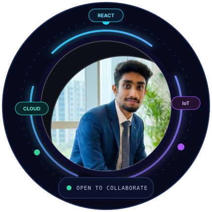
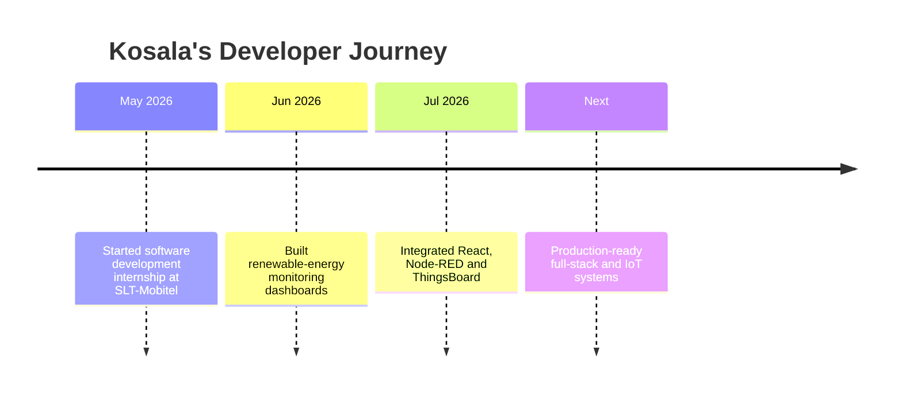

<div align="center">
  
</div>

<div align="center">
  
</div>

<div align="center">
  <a href="https://kosala.netlify.app/"></a>
  <a href="https://www.linkedin.com/in/kosala-d-athapaththu-a453b9248/"></a>
  <a href="mailto:kosalaathapaththu1234@gmail.com"></a>
  <a href="https://wa.me/94719148762"></a>
</div>

<div align="center">
  
  
  
</div>

---

## About me

<table>
<tr>
<td width="62%" valign="top">

```java
public final class Kosala extends SoftwareEngineer {

    String role = "Software Developer Intern @ SLT-Mobitel";
    String degree = "BSc (Hons) Software Engineering";
    String university = "NIBM / Coventry University";
    String location = "Colombo, Sri Lanka";

    String[] currentFocus = {
        "Full-Stack Web Development",
        "IoT and Telemetry Systems",
        "Renewable Energy Dashboards",
        "Backend APIs and Microservices",
        "Applied Machine Learning"
    };

    boolean openToCollaboration = true;
    String principle = "Build clearly. Test carefully. Improve continuously.";
}
```

I build software that connects **clean interfaces, real data, and practical business needs**. My recent work includes React dashboards, Node-RED API flows, ThingsBoard telemetry, client management systems, and renewable-energy monitoring applications.

</td>
<td width="38%" align="center" valign="middle">
  
</td>
</tr>
</table>

---

## Current work

<table>
<tr>
<td width="33%" valign="top">

### Software engineering
- React operational dashboards
- API integration and data flows
- Responsive, user-focused interfaces

</td>
<td width="33%" valign="top">

### IoT and telemetry
- Node-RED integrations
- ThingsBoard dashboards
- MQTT-based live data pipelines

</td>
<td width="33%" valign="top">

### Renewable energy
- Solar monitoring interfaces
- Hydro plant dashboards
- Wind plant digital twins

</td>
</tr>
</table>

---

## Technology stack

<div align="center">
  
  <br/><br/>
  
</div>

<br/>

<div align="center">
  
  
  
  
  
</div>

---

## Featured projects

<table>
<tr>
<td width="50%" valign="top">

### AC Service Management System
**Client project — Supun Group of Companies**

A full service-lifecycle system for customers, AC units, installations, services, payments, complaints, and reminder emails.

`React` `Vite` `Google Apps Script` `Google Sheets`

[](https://github.com/kosaladathapththu/AC-Service-Management-System)

</td>
<td width="50%" valign="top">

### Renewable Energy Dashboards
**Solar, hydro, wind and telemetry monitoring**

Operational dashboards for live plant data, equipment status, power metrics, and digital-twin style visualizations.

`React` `Node-RED` `ThingsBoard` `MQTT`

[](https://github.com/kosaladathapththu/hydro-power-dashboard)

</td>
</tr>
<tr>
<td width="50%" valign="top">

### Hostel Management System
**Full-stack administration platform**

Resident management, rooms, fees, payroll, inventory, suppliers, events, reporting, and multi-role workflows.

`PHP` `MySQL` `JavaScript` `Bootstrap`

[](https://github.com/kosaladathapththu/Hostel-Management-System)

</td>
<td width="50%" valign="top">

### Hotel Management System
**Microservices-based academic project**

Room booking, guest management, billing, REST APIs, React administration UI, and Spring Boot services.

`Java` `Spring Boot` `React` `MySQL`

[](https://github.com/kosaladathapththu/Hotel-Management-System)

</td>
</tr>
<tr>
<td width="50%" valign="top">

### Solar Soiling Web App
**ML-supported solar performance analysis**

An application for solar panel soiling analysis and performance-focused data processing.

`Python` `Jupyter` `Machine Learning`

[](https://github.com/kosaladathapththu/solar-soiling-web-app)

</td>
<td width="50%" valign="top">

### Poetry Web App
**Bilingual publishing platform**

Sinhala and English content publishing with Decap CMS and Netlify Identity for a non-technical client.

`HTML` `CSS` `JavaScript` `Decap CMS` `Netlify`

[](https://github.com/kosaladathapththu/Poetry-Web-App)

</td>
</tr>
</table>

<details>
<summary><b>More projects</b></summary>
<br/>

| Project | Main idea | Technology |
|---|---|---|
| [PizzaMania](https://github.com/kosaladathapththu/PizzaMania) | Android food-ordering application | Java, Android, Firebase |
| [Landslide Detection IoT](https://github.com/kosaladathapththu/Landslide_Ditection-IOT) | IoT early-warning system | C++, sensors |
| [River Trash Collecting Robot](https://github.com/kosaladathapththu/Trash-Collecting-Robot-For--River) | Automated river-cleaning robot | Arduino, C++ |
| [Online Payment Fraud Detection](https://github.com/kosaladathapththu/Online-Payments-Fraud-Detection) | Machine-learning fraud analysis | Python, Jupyter |
| [Library Management System](https://github.com/kosaladathapththu/LibraryManagementSystem) | Desktop library operations | C#, .NET |
| [Code Evolution Tracker](https://github.com/kosaladathapththu/Code_Evolution_Tracker) | Data-structure-based debugging timeline | Java |

</details>

---

## GitHub analytics

<div align="center">
  <picture>
    <source media="(prefers-color-scheme: dark)" srcset="https://github-readme-stats.vercel.app/api?username=kosaladathapththu&show_icons=true&hide_border=true&bg_color=0D1117&title_color=67E8F9&text_color=C9D1D9&icon_color=A78BFA&rank_icon=github" />
    <source media="(prefers-color-scheme: light)" srcset="https://github-readme-stats.vercel.app/api?username=kosaladathapththu&show_icons=true&hide_border=true&bg_color=FFFFFF&title_color=0369A1&text_color=334155&icon_color=7C3AED&rank_icon=github" />
    
  </picture>
  <picture>
    <source media="(prefers-color-scheme: dark)" srcset="https://github-readme-stats.vercel.app/api/top-langs/?username=kosaladathapththu&layout=compact&langs_count=8&hide_border=true&bg_color=0D1117&title_color=67E8F9&text_color=C9D1D9" />
    <source media="(prefers-color-scheme: light)" srcset="https://github-readme-stats.vercel.app/api/top-langs/?username=kosaladathapththu&layout=compact&langs_count=8&hide_border=true&bg_color=FFFFFF&title_color=0369A1&text_color=334155" />
    
  </picture>
</div>

<div align="center">
  
</div>

<div align="center">
  
</div>

---

## Contribution animation

<div align="center">
  <picture>
    <source media="(prefers-color-scheme: dark)" srcset="https://raw.githubusercontent.com/kosaladathapththu/kosaladathapththu/output/github-contribution-grid-snake-dark.svg" />
    <source media="(prefers-color-scheme: light)" srcset="https://raw.githubusercontent.com/kosaladathapththu/kosaladathapththu/output/github-contribution-grid-snake.svg" />
    
  </picture>
</div>

---

## 2026 direction


```mermaid
timeline
    title Kosala's Developer Journey
    May 2026 : Started software development internship at SLT-Mobitel
    Jun 2026 : Built renewable-energy monitoring dashboards
    Jul 2026 : Integrated React, Node-RED and ThingsBoard
    Next : Production-ready full-stack and IoT systems
```

<div align="center">
  
</div>

---

## Contact

<div align="center">
  <b>Open to collaboration on full-stack, IoT, dashboard, and software engineering projects.</b>
  <br/><br/>
  <a href="https://kosala.netlify.app/"></a>
  <a href="https://www.linkedin.com/in/kosala-d-athapaththu-a453b9248/"></a>
</div>

<br/>

<div align="center">
  
</div>
